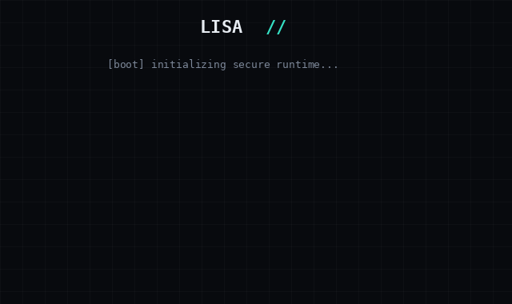

<div align="center">



<br/>


<br/>


### The web-application security checklist for people who already know what they're doing.

**306,392 test cases. 208 categories. Every single one rated P1–P3 by real exploitability — not by which OWASP list it came from.**
Real testing playbooks with actual tools and copy-paste payloads. A command palette. Private notes. Installable as an app. Runs entirely in your browser — nothing you check off, flag, or write down ever leaves your device.

**[▶ Open the live checklist](https://lawxxz.github.io/)**

</div>

<br/>

<p align="center"></p>

<br/>

## Table of contents

- [Why this exists](#why-this-exists)
- [What changed in v2.5](#what-changed-in-v25)
- [Severity model](#severity-model)
- [Feature tour](#feature-tour)
- [Interface](#interface)
- [Architecture deep dive](#architecture-deep-dive)
- [The 13 clusters](#the-13-clusters)
- [Boot sequence](#boot-sequence)
- [Every feature, explained](#every-feature-explained)
- [Performance engineering](#performance-engineering)
- [Data structure](#data-structure)
- [Run it locally](#run-it-locally)
- [Installing as an app](#installing-as-an-app)
- [Regenerating the dataset](#regenerating-the-dataset)
- [Roles this tool is built for](#roles-this-tool-is-built-for)
- [Privacy](#privacy)
- [FAQ](#faq)
- [License](#license)

---

## Why this exists

Most public "bug bounty checklists" are the OWASP Top 10 with extra steps — ten familiar category names, a few hundred generic line items, and severity ratings that don't reflect how a real triage team would actually score a finding. They're good for a first-year appsec course. They are not good enough to run an actual engagement against a mature target.

**LISA//** starts from a different premise: organize the checklist the way a bounty hunter or pentester actually *thinks* about a target's attack surface — by mechanism and by cluster, not by a decade-old top-10 list — and rate every single item the way a triage team actually would: by real-world reachability and impact, not by category alone. The same underlying bug is a **P3** if it needs an already-privileged internal account to reach, and a **P1** if it's reachable pre-authentication by anyone on the internet. That distinction is baked into the data itself, item by item, not left as an exercise for the reader.

<p align="center"></p>

---

## What changed in v2.5

<p align="center"></p>

- 🎯 **+200,000 new P1 items in a single pass**, taking the dataset from 106,392 → **306,392** test cases without renumbering a single existing item — anyone's saved progress from before the expansion still lines up correctly today (see [Architecture deep dive](#architecture-deep-dive) for how).
- 🧩 **28 brand-new categories** covering attack surface most checklists haven't caught up to yet: AI agent & tool-use orchestration, RAG data poisoning, vector database security, service mesh (Istio/Envoy/Linkerd), Kubernetes admission controllers, Open Banking/PSD2, FHIR healthcare APIs, passkey cross-device sync, magic-link auth, GraphQL federation, WebAssembly sandbox escapes, and more.
- 🛠️ **Every category now ships a real testing playbook** — actual tools (`sqlmap`, Burp Suite, `ffuf`, `JWT_Tool`, Nuclei…), numbered steps, and for 41 flagship categories, canonical click-to-copy payloads. Not filler text — the same examples taught in the OWASP Testing Guide and PortSwigger's Web Security Academy.
- ⌘ **Command palette** (`Ctrl`/`Cmd`+`K`) — fuzzy-jump to any of 208 categories instantly.
- 📝 **Private per-item notes** — jot "confirmed, filed as TICKET-142" on any finding, saved only to your browser.
- 📱 **Installable PWA** — add to home screen on Android, iOS, or desktop for a standalone offline-capable app with its own icon.
- 🖥️ **Cinematic boot sequence** — a real terminal-style boot log tied to the actual data load, matrix rain and all (see [Boot sequence](#boot-sequence)).
- ⚡ **Rebuilt data pipeline** — a 21MB single-file blob became a 185KB manifest plus 208 on-demand chunks. Opening even the largest category (5,184 items) is now instant. Full story in [Performance engineering](#performance-engineering).

---

## Severity model

Every one of the 306,392 items carries a `P1` / `P2` / `P3` rating derived from Bugcrowd's public [Vulnerability Rating Taxonomy](https://github.com/bugcrowd/vulnerability-rating-taxonomy) baseline logic — **reachability and impact shift the rating**, exactly like a real triage call:

| | Severity | What it means here |
|---|---|---|
| 🔴 | **P1 — Critical** | Reachable pre-authentication, or leads directly to full account/data compromise |
| 🟠 | **P2 — High** | Real impact, but needs an authenticated session or specific conditions |
| 🔵 | **P3 — Medium** | Valid finding, lower real-world impact — usually needs an already-privileged account |

P4/P5 (informational, best-practice) are deliberately excluded. If it wouldn't get triaged as a real finding on a real program, it's not in here.

---

## Feature tour

<p align="center"></p>

<p align="center"></p>

---

## Interface

<p align="center"></p>

Dark "recon-terminal" UI by default (light mode available), mobile-first with an off-canvas category drawer and bottom action bar on small screens. Every category is collapsed by default — with 306,392 items on one page, nothing renders until you ask for it.

---

## Architecture deep dive

<p align="center"></p>

The single most important engineering decision in this project: **the dataset is never loaded as one file.** Here's the full request lifecycle:

1. **First paint.** The browser requests `index.html` + `css/style.css` + `js/app.js` — all small, all static, all served instantly by GitHub Pages' CDN.
2. **Manifest fetch.** `app.js` fetches `data/manifest.json` (~185KB) — metadata for all 208 categories: title, cluster, methodology, testing playbook, severity counts, and item-ID ranges. **No item text yet.** This is what makes the stats sidebar, severity donut, and category list render instantly.
3. **Category chunks load on demand.** Click a category, and *only that category's* JSON file (`data/categories/{id}.json`) is fetched. The largest category (Authentication & Credential Security, 5,184 items) loads and renders in a single network round-trip — chunked into the DOM via `requestAnimationFrame` batches so the main thread never blocks, even on that scale.
4. **Background preload.** Once the page is interactive, the app quietly preloads the remaining category chunks — 8 concurrent fetches, using browser idle time — so full-text search across all 306,392 items works within a few seconds without ever having blocked the initial render. Search results show *"so far — X/208 categories indexed"* while this completes, then go silent once it's done.
5. **Service worker.** Once registered, a service worker caches the app shell for instant offline boot, and opportunistically caches each category's data the first time you open it — so your progress-through-a-category stays usable offline afterward, without ever forcing a 70MB download on install.

### Why `ranges` is an array, not a `[min, max]` pair

When the 200,000-item P1 expansion happened, new items were appended to existing categories using **fresh, never-before-used IDs** rather than renumbering anything. That was a deliberate trade-off: it means a category's items can now live in two disjoint ID ranges (its original range, plus a new range from the expansion) instead of one contiguous block — more complex to reason about, but it guarantees that **any progress already saved in someone's browser from before the expansion still lines up with the correct items today.** The manifest's `ranges: [[lo,hi], ...]` field and a sorted-segment lookup in `app.js` handle this transparently; the UI never needs to load a category's items just to compute its completion percentage.

---

## The 13 clusters

Categories are grouped into 13 clusters — this is the taxonomy, not an OWASP-list reskin:

<p align="center"></p>

`Access Control` · `Identity` · `Injection` · `Client-Side` · `Server-Side` · `Business Logic` · `API` · `Integrations` · `Data Protection` · `Availability` · `Infrastructure` · `Emerging` · `Attack Chains (Multi-Step)`

The **Emerging** cluster is the largest for a reason — it's where AI/LLM security, Web3/blockchain frontend security, WebXR, service mesh, and the 28 newest categories all live. The **Attack Chains** cluster is the smallest by design: 15 categories, only 62 items total, and every single one is a hand-authored multi-step exploit narrative rather than a generated line item — subdomain takeover walked into CORS/CSP/OAuth trust abuse, SSRF pivoted through cloud metadata into full IAM compromise, race conditions turned into repeatable financial fraud.

---

## Boot sequence

Opening the app plays a real terminal boot sequence — not a fake loading spinner. It's tied to the actual manifest fetch: the `[data] manifest received — 208 categories` and `indexing 306,392 test cases…` lines only appear once that data has genuinely arrived. Matrix-style code rain runs behind it, the logo has a subtle RGB-glitch flicker, and a progress bar tracks real load state. Tap anywhere or press any key to skip straight in. It respects `prefers-reduced-motion` and degrades to a near-instant, animation-free boot for anyone who needs that.

---

## Every feature, explained

<details>
<summary><strong>🔎 Instant client-side search</strong></summary><br/>

Type in the search bar and every one of the (currently indexed) 306,392 items is filtered client-side, in your browser, with no network round-trip. Results are capped at 150 with a "load more" button so the DOM never has to render more than what's on screen. Matching text is highlighted inline.
</details>

<details>
<summary><strong>⌘ Command palette</strong></summary><br/>

`Ctrl`/`Cmd`+`K` opens a fuzzy-search modal scoped to categories, not items — the fast path when you know which category you want and don't want to scroll a 208-entry sidebar. Arrow keys to navigate, `Enter` to jump, `Escape` to close.
</details>

<details>
<summary><strong>🛠️ Testing playbooks</strong></summary><br/>

Every category's expanded view shows a **Tools** row (real, named tools — `sqlmap`, Burp Suite extensions, `ffuf`, `JWT_Tool`, Nuclei, `testssl.sh`, `trufflehog`, `kube-hunter`…), a numbered **How to test** sequence, and for 41 flagship categories, **Example payloads** in a monospace block with a one-click copy button.
</details>

<details>
<summary><strong>📝 Private per-item notes</strong></summary><br/>

Click the note icon on any item to expand an inline textarea. Auto-saves 350ms after you stop typing. Items with a saved note get a small glowing dot on the icon so annotated findings are spottable at a glance in a list of thousands. Notes are included in the JSON export and wiped by "Reset all progress" like everything else.
</details>

<details>
<summary><strong>🚩 Flagging</strong></summary><br/>

Flag anything to revisit later, independent of whether it's checked off. "Show flagged only" filters the whole list down to just those.
</details>

<details>
<summary><strong>🎚️ Severity filters</strong></summary><br/>

Isolate P1, P2, or P3 (or any combination) instantly, composable with the search query and flagged-only filter.
</details>

<details>
<summary><strong>📈 Progress tracking</strong></summary><br/>

Per-category completion rings, a global progress gauge with an animated halo, and a persistent slim progress bar that fades into the top bar once you've scrolled past the hero — so your completion % stays visible while deep inside a 2,000-item category.
</details>

<details>
<summary><strong>📊 Severity donut</strong></summary><br/>

A real proportional chart in the sidebar (not decoration) showing the dataset's actual P1/P2/P3 composition — 81.1% / 11.6% / 7.3%. Built from live totals at boot.
</details>

<details>
<summary><strong>📤 JSON export</strong></summary><br/>

One click downloads your full state — done items, flags, and notes — as a timestamped JSON file. Useful as a backup, or to move progress between devices manually (nothing syncs automatically — see <a href="#privacy">Privacy</a>).
</details>

<details>
<summary><strong>📱 Installable PWA</strong></summary><br/>

A full Web App Manifest and service worker make this installable on Android, iOS, and desktop — standalone window, its own icon, offline-capable app shell. See <a href="#installing-as-an-app">Installing as an app</a>.
</details>

<details>
<summary><strong>♿ Keyboard & accessibility</strong></summary><br/>

Every category header, cluster header, and nav item is a real `role="button"` with `tabindex`, full `Enter`/`Space` activation, and live `aria-expanded` state — not just a clickable `<div>`. Modals close on `Escape` and backdrop click. Toasts are `aria-live="polite"`. Motion throughout respects `prefers-reduced-motion`.
</details>

<details>
<summary><strong>🌓 Dark / light themes</strong></summary><br/>

Full theme parity, not just an inverted filter — every color token, chart, and glow effect has a dedicated light-mode value.
</details>

---

## Performance engineering

The honest version of this story: the original build shipped the entire dataset as a single `data.js` global loaded via a blocking `<script>` tag. At 21MB (and it would be 60MB+ today, post-expansion), the browser had to download and parse the *entire* file before anything could render — and opening the largest category built 2,000+ real DOM nodes synchronously in one shot, freezing the tab.

The fix was architectural, not cosmetic:

- **Split the data** into a manifest + 208 on-demand chunk files (see [Architecture deep dive](#architecture-deep-dive)).
- **Chunked rendering** — item rows render in `requestAnimationFrame` batches instead of all at once, so opening even the 5,184-item category never produces a long task.
- **`content-visibility: auto`** on category cards and item rows — the browser skips layout/paint work entirely for anything off-screen, which is most of a 5,000-item list at any given scroll position.
- **Background preload with concurrency control** — 8 parallel fetches during idle time, so search becomes fully comprehensive within seconds without ever competing with the initial render for bandwidth or main-thread time.

Every one of the above was verified in an actual headless-browser test pass, not assumed — including one real debugging session where a suspected animation bug turned out to be a limitation in the specific test tool, confirmed by checking actual rendered pixels rather than trusting the browser's own introspection API.

---

## Data structure

```
data/
  manifest.json              ← ~185KB — metadata + playbook for all 208 categories, no item text
  categories/
    1.json                   ← { id, items: [{ id, severity, text }] }
    2.json
    ...
    208.json
```

Each manifest entry:

```js
{
  id, slug, title, cluster, methodology,
  count, p1, p2, p3,              // item totals, precomputed
  ranges: [[lo, hi], ...],        // item-id ranges owned by this category (can be >1)
  playbook: {
    tools: ["Burp Suite (Autorize)", "Burp Turbo Intruder", ...],
    steps: ["Map every object reference...", ...],
    payloads: ["' OR '1'='1' -- -", ...]   // present for 41 flagship categories
  }
}
```

---

## Run it locally

No build step. No `npm install`. It's HTML, CSS, and one JS file.

```bash
git clone https://github.com/lawxxz/lawxxz.github.io.git
cd lawxxz.github.io
python3 -m http.server 8080
# → http://localhost:8080
```

(A real HTTP server is required — `data/*.json` won't load over `file://` due to `fetch()` CORS restrictions.)

Deploys as-is to GitHub Pages — push to a repo, enable Pages on `main`. Includes `.nojekyll` so the `data/` folder is served untouched.

---

## Installing as an app

The site is a full [Progressive Web App](https://web.dev/progressive-web-apps/):

- **Android (Chrome):** **⋮ → Install app** (or the automatic install prompt).
- **iOS (Safari):** **Share → Add to Home Screen**.
- **Desktop (Chrome/Edge):** click the install icon (⊕) in the address bar.

Installed, it opens full-screen with no browser chrome. The service worker caches the app shell for instant offline boot, plus every category you've opened stays available offline afterward.

**Want a real `.apk`?** [PWABuilder](https://www.pwabuilder.com) reads the manifest and packages a signed Android APK/AAB via a Trusted Web Activity in about two minutes — paste the deployed URL, no coding required.

---

## Regenerating the dataset

The dataset is produced programmatically — category taxonomy × technical vector pools × auth-context severity axis — which is how it reaches 300k+ genuinely distinct entries without OWASP-list padding. To extend a category, add entries to its pattern list and re-run the generator to rebuild `data/manifest.json` and the corresponding files under `data/categories/`. The generator itself lives outside this repo's runtime bundle.

---

## Roles this tool is built for

| Role | How it's used |
|---|---|
| **Bug bounty hunter** | Scope-specific pre-engagement checklist; flag findings as you go, export progress before writing up |
| **Pentester** | Methodology reference mid-engagement — every category's playbook has the actual tool/technique, not just a vuln name |
| **AppSec engineer** | Coverage audit against your own SDLC checklist; the cluster breakdown maps cleanly onto how modern attack surface is actually organized |
| **Security student** | A denser, more realistic alternative to OWASP Top 10 study lists, with real payloads to learn from |
| **CTF / lab practice** | Command palette + search make it fast to jump straight to a specific vuln class you're drilling |

---

## Privacy

Nothing about your checklist progress, flags, or notes is ever transmitted anywhere. It's stored in `localStorage` on your device only. **Export** downloads a JSON snapshot for backup or manual transfer between devices.

The installed PWA's service worker caches only the app shell and whatever category data you've actually opened — it doesn't call home, doesn't sync, and doesn't pre-fetch anything beyond the manifest.

---

## FAQ

<details>
<summary><strong>Why isn't this organized by OWASP Top 10?</strong></summary><br/>
Because real attack surfaces aren't. The OWASP Top 10 is a great teaching tool and a bad checklist structure — it collapses dozens of genuinely distinct vulnerability classes into ten buckets and says nothing about reachability. This checklist is organized the way you'd actually map a target: by cluster and mechanism, with severity computed per-item from context.
</details>

<details>
<summary><strong>Is the severity rating a substitute for real triage?</strong></summary><br/>
No. It's a starting point calibrated against Bugcrowd's public VRT logic — always confirm real-world impact against the specific program's scope and reward table before you report anything.
</details>

<details>
<summary><strong>Does this work offline?</strong></summary><br/>
Yes, once installed as a PWA (or after your first visit populates the service worker cache) — the app shell boots offline instantly, and any category you've opened before stays available without a connection.
</details>

<details>
<summary><strong>Can I sync progress across devices?</strong></summary><br/>
Not automatically — nothing leaves your browser by design. Use the JSON export/import to move state manually.
</details>

---

## License

MIT — see [`LICENSE`](LICENSE).

<br/>

<div align="center">
<sub>Built for people who test things for a living. No SaaS, no signup, no tracking pixel counting how many boxes you checked.</sub>
</div>
