<div align="center">


<a href="https://lawxxz.github.io/"></a>

<br/>


<br/><br/>

**306,392 test cases · 208 categories (193 single-finding + 15 multi-step attack chains) · P1 / P2 / P3 only · web-application scope only**

Rebuilt from Bugcrowd VRT priority methodology. No OWASP Top-10 wrapper. No mobile/native, IoT firmware, or automotive filler — every entry is a web-app-reachable finding.

100% static. Zero backend. Zero telemetry. Progress lives only in your browser's `localStorage`.

<a href="https://lawxxz.github.io/"></a>

</div>

<br/>

<div align="center">
  
</div>

<br/>

<div align="center">

### 🧭 Jump to

[What changed](#-what-changed-in-v2) · [Live demo](#-live-demo) · [Severity model](#-severity-distribution) · [Features](#-features) · [Screenshot](#-interface) · [Structure](#-data-structure) · [Run locally](#-run-it-locally) · [Install as an app](#-installing-as-an-app) · [Regenerate data](#-regenerating-the-dataset) · [Privacy](#-privacy) · [License](#-license)

</div>

---

## 📌 What changed in v2

The original dataset (`data.js` v1, 20,200 items / 75 categories) had no severity rating at all, and a chunk of its items were generic/duplicated "fundamentals" rather than distinct, testable findings. v2 is a ground-up rebuild, expanded across four further passes:

<div align="center">

`68` → `88` → `129` → `152` → `180` → **`208` categories**
`30,834` → `50,565` → `77,382` → `100,122` → `106,392` → **`306,392` items**

</div>

- 🎯 **Severity is real, not decorative.** Every one of the 306,392 items carries a `P1` (Critical) / `P2` (High) / `P3` (Medium) rating, derived from Bugcrowd's public [Vulnerability Rating Taxonomy](https://github.com/bugcrowd/vulnerability-rating-taxonomy) baseline logic.
- 🚫 **No OWASP Top-10 framing.** Categories are organized the way a bounty hunter actually thinks about a target's attack surface.
- 🌐 **Web-application scope only.** Native mobile app internals, IoT firmware, and automotive/CAN-bus categories were dropped.
- 🧩 **193 single-finding categories** covering everything from access control and injection classes through modern browser APIs (WebXR, FedCM, Trusted Types, Private Network Access) and platform-specific surfaces (headless CMS, e-commerce app ecosystems, e-signature workflows, kiosk-mode terminals, webmail clients) — including a **200,000-item P1 expansion pass** adding 28 categories for emerging attack surface (AI agent/tool-use security, RAG data poisoning, service mesh, Kubernetes admission controllers, Open Banking/PSD2, passkey sync, and more).
- ⛓️ **15 "Attack Chains" categories (62 items) — depth, not breadth.** Hand-authored, not pattern-generated: each item is a real multi-step exploit narrative that chains 2–4 individually-plausible findings into a critical end state — subdomain takeover into CORS/CSP/OAuth trust abuse, SSRF walked through cloud metadata into full IAM compromise, IDOR combined with a recovery-flow gap into account takeover, race conditions turned into repeatable financial fraud, cache poisoning turned into mass stored XSS, prototype pollution turned into privilege escalation, and more. Find these under **Attack Chains (Multi-Step)** in the sidebar.
- 🖥️ **Completely new interface.** Dark "recon-terminal" UI, rebuilt mobile-first: off-canvas category drawer, bottom action bar, collapsed-by-default categories, live severity filters, flagging, JSON progress export.
- 🛠️ **Real testing playbooks, not just descriptions.** Every category now ships actual tools (sqlmap, Burp Suite, ffuf, JWT_Tool, Nuclei…), numbered "how to test" steps, and — for 41 flagship categories — canonical, click-to-copy payloads (SQLi, XSS, SSRF, XXE, SSTI, JWT attacks, and more).
- 📱 **Installable PWA.** Add to home screen on Android/iOS/desktop for a standalone, offline-capable app with its own icon — no app store needed. See [Installing as an app](#-installing-as-an-app).
- ⌘ **Command palette (Ctrl/Cmd+K), private per-item notes, and a boot sequence** — instant fuzzy-jump to any category, inline notes saved only to your browser, and a terminal-style boot animation tied to real data loading.

---

## 🎬 Live demo

<div align="center">
  
  <br/>
  <sub>Live‑filtered against all 306,392 entries, client-side, no network round trip.</sub>
</div>

---

## 📊 Severity distribution

<div align="center">
  
</div>

| Priority | Count | Meaning |
|---|---:|---|
| 🔴 **P1 — Critical** | 248,544 | Immediate, severe compromise: RCE, auth bypass, mass PII exposure, cross-tenant takeover |
| 🟠 **P2 — High** | 35,449 | Significant but scoped impact: privileged-only reach, single-account compromise, high-value logic abuse |
| 🔵 **P3 — Medium** | 22,399 | Real but limited impact: information disclosure, UI-only issues, low-sensitivity scope |

### A note on scale vs. depth

The single-finding categories are pattern-generated: a real vulnerability class tested against a wide, genuine set of parameters/endpoints/auth-contexts (**breadth**). The **Attack Chains** section is the opposite approach: a small, hand-written set of narrative multi-step scenarios where the value is in the causal chain between findings, not the count (**depth**). Both are now in this dataset — use the single-finding categories to sweep a target's full surface, and the Attack Chains section as a prompt for *"what does this low-severity finding turn into if I chain it with something else?"*

---

## ✨ Features

<div align="center">

| | | |
|:---:|:---:|:---:|
| 🌓 **Dark / light recon UI** | 🔎 **Instant client-side grep** | 🚩 **Flag & annotate findings** |
| Off-canvas mobile drawer, bottom action bar | Search 306,392 items with zero latency | Mark anything to revisit before you submit |
| 📈 **Live progress rings** | 🎚️ **Severity filter chips** | 📤 **JSON export** |
| Per-category + total engagement completion | Isolate P1 / P2 / P3 instantly | Snapshot your checklist state (incl. notes) to a file |
| 🛠️ **Real testing playbooks** | ⛓️ **Attack chain narratives** | 💾 **`localStorage` only** |
| Real tools + numbered steps + copyable payloads per category | 15 hand-written multi-step exploit paths | Nothing you check off ever leaves your device |
| ⌘ **Command palette** | 📝 **Private per-item notes** | 📱 **Installable PWA** |
| Ctrl/Cmd+K to fuzzy-jump to any of 208 categories | Inline notes on any finding, saved locally | Add to home screen, works offline |

</div>

---

## 🖼️ Interface

<div align="center">
  
</div>

---

## 🗂️ Data structure

The dataset is **not** a single bundled file — it's split for performance (see [Why it's split](#-why-the-data-is-split) below). A lightweight manifest carries metadata for all 208 categories, and each category's items live in their own JSON file, fetched only when that category is opened:

```
data/
  manifest.json              ← ~185KB — every category's metadata, no item text
  categories/
    1.json                   ← { id, items: [{ id, severity, text }] }
    2.json
    ...
    208.json
```

Each manifest entry looks like:

```js
{
  id, slug, title, cluster, methodology,
  count, p1, p2, p3,           // item totals, precomputed
  ranges: [[lo, hi], ...],     // item-id ranges owned by this category (can be >1 — see below)
  playbook: {
    tools: ["Burp Suite", "sqlmap", ...],
    steps: ["Identify every parameter that reaches a query…", ...],
    payloads: ["' OR '1'='1' -- -", ...]   // present for 41 flagship categories
  }
}
```

`ranges` is an array, not a single `[min, max]` pair, because the 200,000-item P1 expansion appended new items to existing categories using fresh IDs rather than renumbering — so any progress already saved in someone's browser from before the expansion stays valid. The app reconstructs per-category progress from these ranges without ever needing to fetch a category's items.

### ⚡ Why the data is split

The original v1/early-v2 build shipped everything as one `data.js` global (~21MB, then would've been ~60MB+ post-expansion) loaded via a blocking `<script>` tag — the browser had to download and parse the entire thing before anything could render. Splitting it means: the manifest loads in well under a second, categories fetch on demand when you open them, and the rest quietly indexes in the background for search — all while the page is already interactive.

---

## 🚀 Run it locally

No build step. Clone/download and open `index.html`, or serve statically:

```bash
git clone https://github.com/lawxxz/lawxxz.github.io.git
cd lawxxz.github.io
python3 -m http.server 8000
# → http://localhost:8000
```

Deploys as-is to GitHub Pages — just push to a repo and enable Pages on the `main` branch. Includes a `.nojekyll` file so the `data/` folder is served as-is.

---

## 📱 Installing as an app

The site is a full [Progressive Web App](https://web.dev/progressive-web-apps/) — installable with its own icon and offline support, no app store required:

- **Android (Chrome):** open the site, tap **⋮ → Install app** (or the install prompt Chrome shows automatically).
- **iOS (Safari):** **Share → Add to Home Screen**.
- **Desktop (Chrome/Edge):** click the install icon (⊕) in the address bar.

Once installed it opens full-screen with no browser chrome, and a service worker caches the app shell for instant offline boot — plus every category you've opened stays available offline afterward.

**Want a real `.apk`?** The easiest path is [PWABuilder](https://www.pwabuilder.com) — paste in the deployed URL, it reads the manifest and packages a signed Android APK/AAB via a Trusted Web Activity in about two minutes, no coding required.

---

## 🔁 Regenerating the dataset

The dataset is produced programmatically (category taxonomy × technical vector pools × auth-context severity axis) rather than hand-typed, which is how it reaches 300k+ genuinely distinct entries without OWASP-list padding. The generator lives outside this repo's runtime bundle; if you want to extend a category, add entries to its pattern list and re-run the build to regenerate `data/manifest.json` and the corresponding files in `data/categories/`.

---

## 🔒 Privacy

Nothing about your checklist progress, flags, or notes is ever transmitted anywhere. It's stored in `localStorage` on your device only. The **Export** button lets you download a JSON snapshot for backup or to move between devices manually.

The installed PWA's service worker caches only the app shell (HTML/CSS/JS/icons) and whatever category data you've actually opened — it doesn't call home, doesn't sync anywhere, and doesn't pre-fetch anything beyond the manifest.

---

## 📄 License

MIT — see [`LICENSE`](LICENSE).

<br/>

<div align="center">
  

  <sub>Built for authorized bug bounty & whitebox engagements only.</sub>
</div>
